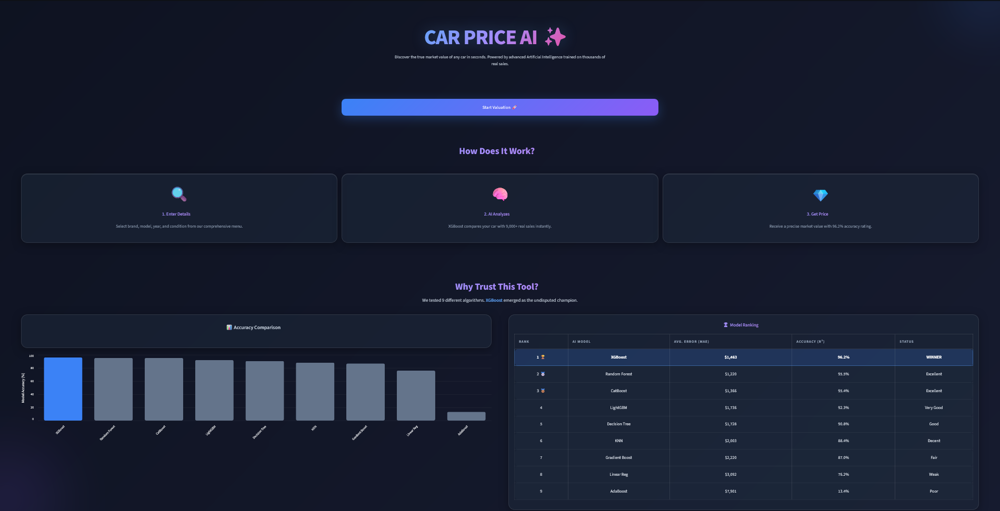
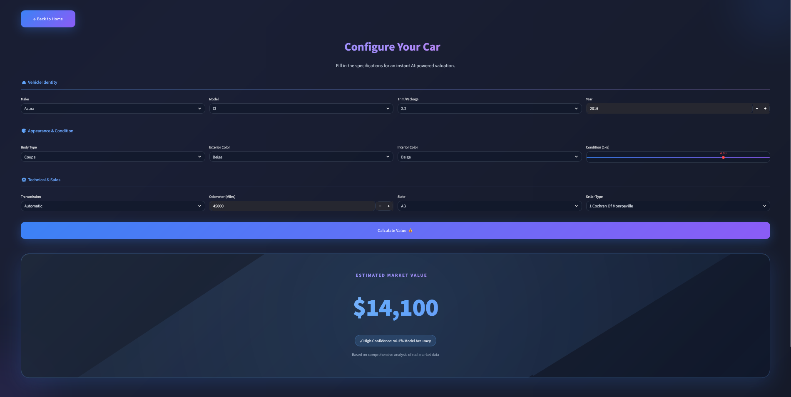

# 🚗 Used Car Price Prediction App

A machine learning-powered web application that predicts the market value of used cars in real time. Built with a clean Streamlit interface, it delivers instant price estimates based on vehicle specifications.


## ✨ Features

### 🤖 High-Accuracy ML Model
- **XGBoost** — Optimized gradient boosting algorithm for precise predictions
- **Scikit-learn Pipeline** — Clean preprocessing and encoding integrated into the model
- **Pre-trained & Ready** — Load `.joblib` model files instantly, no retraining needed

### 🎨 Interactive User Interface
- **Streamlit UI** — Modern, responsive, and intuitive web interface
- **Real-Time Results** — Instant price estimate on every input change
- **Rich Visualizations** — Charts and analytics powered by Matplotlib & Altair

### 📊 Comprehensive Feature Coverage
- **Make & Model** — Wide range of vehicle brands and models supported
- **Year & Mileage** — Core depreciation factors included
- **Transmission & Condition** — Full vehicle specification inputs

### 🛠️ Full Data Science Lifecycle
- **Exploratory Data Analysis** — Documented in `CARS.ipynb`
- **Feature Engineering** — Custom transformations for improved model performance
- **Model Optimization** — Hyperparameter tuning and cross-validation

## 📸 Screenshots

### 🏠 Main Interface


### 📊 Prediction Result


## 🚀 Quick Start

1. **Clone the repository:**
   ```bash
   git clone https://github.com/Vugar-Mirzoyev/Car-Price-Prediction.git
   cd Car-Price-Prediction
   ```

2. **Install dependencies:**
   ```bash
   pip install -r requirements.txt
   ```
   > **Note:** The `car_prices.csv` dataset is excluded from the repository due to size constraints. The application runs using the pre-trained `.joblib` model files.

3. **Run the application:**
   ```bash
   streamlit run app.py
   ```

4. Open **http://localhost:8501** in your browser and start predicting!

## 🔒 Privacy & Data

This application runs **entirely on your local machine**:

- ✅ No user data is collected or transmitted
- ✅ All predictions are computed locally
- ✅ Pre-trained model files included — no external API calls required
- ✅ Safe to run in offline environments

## 🛠️ Tech Stack

| Layer | Technology |
|---|---|
| Data Processing | Pandas, NumPy |
| Machine Learning | XGBoost, Scikit-learn |
| Interface | Streamlit |
| Visualization | Matplotlib, Altair |
| Model Persistence | Joblib |

## 📁 Project Structure

```
Car-Price-Prediction/
├── assets/             # Screenshots and visual assets
│   ├── main.png        # Main interface screenshot
│   └── prediction.png  # Prediction result screenshot
├── app.py              # Main Streamlit application
├── CARS.ipynb          # EDA, feature engineering & model training
├── *.joblib            # Pre-trained model, scaler, and encoder files
└── requirements.txt    # Project dependencies
```

## 📜 License

This project is developed as a **Data Science portfolio project** and is open for learning and reference purposes.

---

*Built end-to-end as a portfolio project — from raw data to a deployed prediction interface.*
